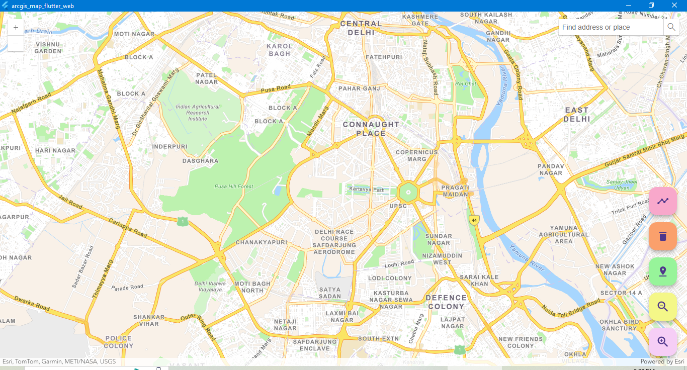
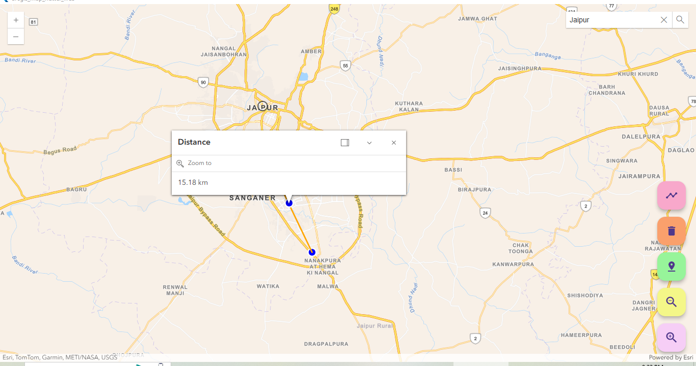

# ArcGIS Desktop Application (Flutter + ArcGIS JS API)

This project is a **Windows desktop GIS (Geographic Information System) application** built using **Flutter** and the **ArcGIS JavaScript API**.  
It displays interactive maps with features like polygon overlays, location search, zoom control, and custom pin drops.

---

## 💡 Features

- 🗺️ Display ArcGIS map using local HTML (embedded in WebView)
- 📍 Drop custom pins on the map
- 🔍 Location search functionality (e.g., "Ajmer")
- ✏️ Polygon overlay drawing
- ➕ Zoom in/out and delete features
- 💻 Built as a Windows desktop app using Flutter

---

## 🛠️ Tech Stack

- **Flutter (Desktop)**
- **InAppWebView** (Flutter plugin)
- **ArcGIS JavaScript API**
- **HTML + JavaScript** for map rendering

---

## 📂 Folder Structure
arcgis_map_flutter_web/
├── lib/
│ └── main.dart # Flutter main app file
├── assets/
│ └── map.html # Local HTML file with ArcGIS JS API
├── pubspec.yaml
└── README.md

🧪 How to Run the Project 
⚠️ **Disclaimer:** Make sure you have **Flutter installed with Windows desktop support enabled.**  
> Setup guide: [Flutter Desktop Setup](https://docs.flutter.dev/desktop)

>Run the following commands on terminal:

flutter clean
flutter pub get
flutter run -d windows

📸 Output Screenshots 
> Here’s how the app looks while running on Windows desktop:
🗺️ Full Map View

✏️ Distance between two points

🙋‍♀️ Author
Shalu Choudhary
GitHub: @Shalu-choudhary
